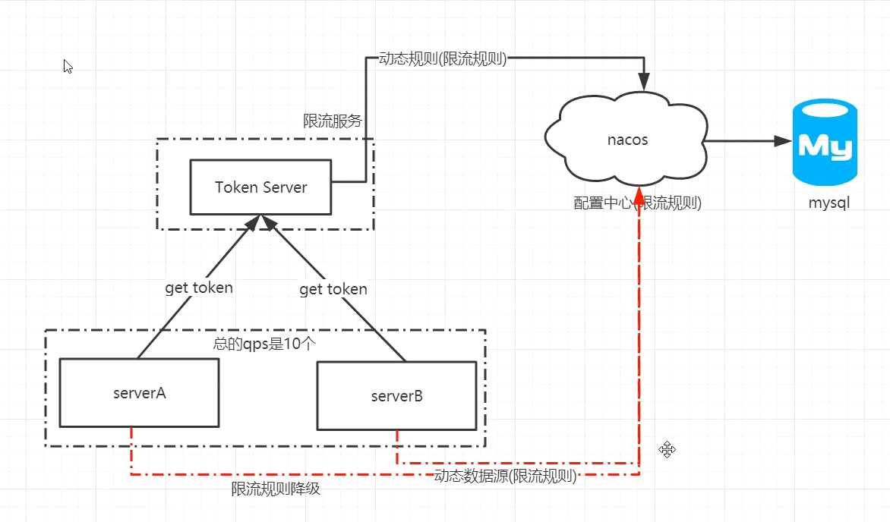
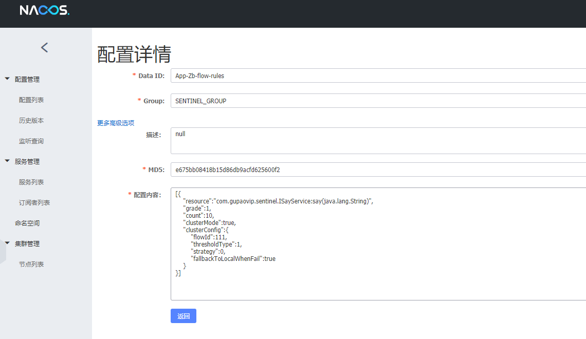

## Sentinel + Dubbbo 整合限流

支持注解  添加依赖

```xml
        <dependency>
            <groupId>com.alibaba.csp</groupId>
            <artifactId>sentinel-dubbo-adapter</artifactId>
            <version>1.6.3</version>
        </dependency>
        <dependency>
            <groupId>org.springframework.boot</groupId>
            <artifactId>spring-boot-starter-aop</artifactId>
        </dependency>
```

## @SentinelResource 注解


### Spring AOP

若您的应用使用了 Spring AOP，您需要通过配置的方式将 `SentinelResourceAspect` 注册为一个 Spring Bean：

```java
@Configuration
public class SentinelAspectConfiguration {

    @Bean
    public SentinelResourceAspect sentinelResourceAspect() {
        return new SentinelResourceAspect();
    }
}
```

## 限流行为

如果被限流了,  name采取的限流控制行为.(线程池为例)

直接拒绝(默认情况)

warm up (预热) ->dubbo源码分析的时候, (负载均衡算法里面涉及到的weight -> 启动的时间)

迅速排队

flowRule.setControlBehavior(RuleConstant,CONTROL_BEHAVIOR_DEFAULT);

集群限流实现原理图



csp.sentinel.log.use.pid	 boolean

日志文件名中是否加入进程号，用于单机部署多个应用的情况


首先单机限流  

pom.xml文件中需要以下依赖

```xml
        <dependency>
            <groupId>com.alibaba.csp</groupId>
            <artifactId>sentinel-core</artifactId>
            <version>1.6.3</version>
        </dependency>
		
```


```java
 FlowRule flowRule=new FlowRule();
		// 设置要限流的方法 全路径
        flowRule.setResource("com.gupaovip.sentinel.ISayService:say(java.lang.String)");
        flowRule.setCount(10); // sql数
        flowRule.setGrade(RuleConstant.FLOW_GRADE_QPS); //设置为qps
        // QPS流量控制 默认为直接拒绝
        flowRule.setControlBehavior(RuleConstant.CONTROL_BEHAVIOR_DEFAULT);
        //流控针对的调用来源  如果加了这个 调用端需要通过//    RpcContext.getContext().setAttachment("dubboApplication","Sentinel-web");
        flowRule.setLimitApp("Sentinel-web");
		// 使用规则
        FlowRuleManager.loadRules(Collections.singletonList(flowRule));
```

如何被sentinel-dashboard 所监控

依赖

```xml
        <dependency>
            <groupId>com.alibaba.csp</groupId>
            <artifactId>sentinel-transport-simple-http</artifactId>
            <version>1.6.3</version>
        </dependency>
```


启动时在jvm参数中加入-Dcsp.sentinel.dashboard.server=ip:port -Dproject.name=xxx


## 接下来实现Sentinel 集群的搭建

首先搭建一个token-server(Cluster-server)  ,用来给cluster-client获取限流规则

### 一,依赖

```xml
		<!--        ClusterServer-->
        <dependency>
            <groupId>com.alibaba.csp</groupId>
            <artifactId>sentinel-cluster-server-default</artifactId>
            <version>1.6.3</version>
        </dependency>
        <!--        数据源-->
        <dependency>
            <groupId>com.alibaba.csp</groupId>
            <artifactId>sentinel-datasource-nacos</artifactId>
            <version>1.6.3</version>
        </dependency>
```

### 二,启动 创建一个ClusterServer类用来启动

```java
public class ClusterServer {
    public static void main(String[] args) throws Exception {
        ClusterTokenServer clusterTokenServer = new SentinelDefaultTokenServer();
        ClusterServerConfigManager.loadGlobalTransportConfig(
                //  setIdleSeconds 空闲时间
                new ServerTransportConfig().setIdleSeconds(600).setPort(9999));
        ClusterServerConfigManager.loadServerNamespaceSet(Collections.singleton("App-Zb"));
        clusterTokenServer.start();
    }
}

```

### 三,NacosDataSourceInitFunc  从Nacos 获取规则  

```java
public class NacosDataSourceInitFunc implements InitFunc {
    private final  String remoteAddress="192.168.5.178";// nacos 地址

    private final String groupId="SENTINEL_GROUP";// group ID

    private final String FLOW_POSTFIX="-flow-rules"; // Data Id  namespace+FLOW_POSTFIX
    // 意味着当前的token-server会从nacos上获取限流规则
    @Override
    public void init() throws Exception {

        ClusterFlowRuleManager.setPropertySupplier(namespace ->{
            // 从nacos 远程获取到source(List<FlowRule>)  然后设置能数据源
            ReadableDataSource<String, List<FlowRule>> rds=
                    new NacosDataSource<List<FlowRule>>(remoteAddress,groupId,namespace+FLOW_POSTFIX,
                            source -> JSON.parseObject(source,new TypeReference<List<FlowRule>>(){}));
            return rds.getProperty();
        });
    }
}

```

### 四,使用spi加载NacosDataSourceInitFunc,

resources文件夹创建META-INF.services

创建File

com.alibaba.csp.sentinel.init.InitFunc 

内容为NacosDataSourceInitFunc的全路径


### 五,Cluster-client 配置

pom.xml

```xml
        <!--  Sentinel -->
        <dependency>
            <groupId>com.alibaba.csp</groupId>
            <artifactId>sentinel-dubbo-adapter</artifactId>
            <version>1.6.3</version>
        </dependency>
        <!--        Sentinel 集群客户端 -->
        <dependency>
            <groupId>com.alibaba.csp</groupId>
            <artifactId>sentinel-cluster-client-default</artifactId>
            <version>1.6.3</version>
        </dependency>

        <!--        nacos 数据源   -->
        <dependency>
            <groupId>com.alibaba.csp</groupId>
            <artifactId>sentinel-datasource-nacos</artifactId>
            <version>1.6.3</version>
        </dependency>
        <!--         这个是用来连接sentinel hashboard -->
        <dependency>
            <groupId>com.alibaba.csp</groupId>
            <artifactId>sentinel-transport-simple-http</artifactId>
            <version>1.6.3</version>
        </dependency>
```


### 六, 表示当前的节点是集群客户端

ClusterStateManager.applyState(ClusterStateManager.CLUSTER_CLIENT);

```java
@SpringBootApplication
public class SentinelServiceApplication {

    public static void main(String[] args) throws IOException {
        // 表示当前的节点是集群客户端
        ClusterStateManager.applyState(ClusterStateManager.CLUSTER_CLIENT);
        
        SpringApplication.run(SentinelServiceApplication.class, args);
        // web项目有tomcat可以保持线程阻塞不被关闭,非web项目 启动完就结束了
        System.in.read();
    }
}
```


### 七,创建InitFunc的实现类

先从cluster-server取FlowRules, 取不到去nacos取(这样的话就是单机限流了)

```java
public class DataSourcesInitFunc  implements InitFunc{
    // token-server 的地址
    private final String CLUSTER_SERVER_HOST="localhost";
    // 端口号
    private final int CLUSTER_SERVER_PORT=9999;
    // 请求超时时间
    private final int REQUEST_TIME_OUT=30000;
    // `namespace`
    private final String APP_NAME="App-Zb";

    // naocs 的配置
    private final String remoteAddress="192.168.5.178";//nacos 远程地址
    private final String groupId="SENTINEL_GROUP";// group ID
    private final String FLOW_POSTFIX="-flow-rules";// namespace+ FLOW_POSTFIX = dataId
    @Override
    public void init() throws Exception {
        // 加载集群信息
        loadClusterClientConfig();
        registryClusterFlowRuleProperty();
    }

    private void loadClusterClientConfig(){
        //群集客户端分配配置
        ClusterClientAssignConfig clusterClientAssignConfig = new ClusterClientAssignConfig();
        clusterClientAssignConfig.setServerHost(CLUSTER_SERVER_HOST);// 设置集群客户端host
        clusterClientAssignConfig.setServerPort(CLUSTER_SERVER_PORT);// 设置集群客户端port
        ClusterClientConfigManager.applyNewAssignConfig(clusterClientAssignConfig);

        ClusterClientConfig clusterClientConfig=new ClusterClientConfig();
        clusterClientConfig.setRequestTimeout(REQUEST_TIME_OUT);
        ClusterClientConfigManager.applyNewConfig(clusterClientConfig);
    }
    // 注册动态数据规则
    private void registryClusterFlowRuleProperty(){
        ReadableDataSource<String, List<FlowRule>> rds=
                new NacosDataSource<>(remoteAddress,groupId,APP_NAME+FLOW_POSTFIX,
                        source-> JSON.parseObject(source,new TypeReference<List<FlowRule>>(){}));
        FlowRuleManager.register2Property(rds.getProperty());
    }
}
```

### 八,  使用第四步spi的机制加载DataSourcesInitFunc

### 九,在nacos页面添加配置



除了dataid(由namespace和FLOW_POSTFIX组成)  groupId

content(内容)  为

```json
[{
    "resource":"com.gupaovip.sentinel.ISayService:say(java.lang.String)",
    "grade":1,
    "count":10,
    "clusterMode":true,
    "clusterConfig":{
        "flowId":111,
        "thresholdType":1,
        "strategy":0,
        "fallbackToLocalWhenFail":true
    }
}]
```

List<FlowRules>

其中resource资源名(限流)

grade  1为qps

count  限流数

clusterMode 是否是集群

clusterConfig 集群配置:{

```java
// （必需）全局唯一的规则 ID，由集群限流管控端分配.
private Long flowId;

// 阈值模式，默认（0）为单机均摊，1 为全局阈值.
private int thresholdType = ClusterRuleConstant.FLOW_THRESHOLD_AVG_LOCAL;

private int strategy = ClusterRuleConstant.FLOW_CLUSTER_STRATEGY_NORMAL;

// 在 client 连接失败或通信失败时，是否退化到本地的限流模式
private boolean fallbackToLocalWhenFail = true;
```

}


### 十,启动Cluster-Client

jvm 参数

一台机器的时候加:     -Ddubbo.protocol.port=20881  -Ddubbo.application.qos.port=33333 -Dcsp.sentienl.log.use.pid=true  1:协议端口,2:qos端口(运维用的),

3:日志文件名中是否加入进程号，用于单机部署多个应用的情况

```java
-Dcsp.sentinel.dashboard.server=192.168.5.179:8888 -Dproject.name=App-Zb
```

意义:sentinel.dashboard.server的ip:port   project.nname 名称   


